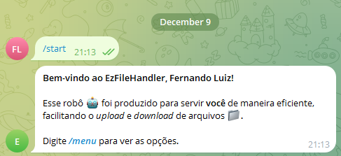

# EzFileHandler

EzFileHandler é um bot do Telegram que permite aos usuários enviar, listar, baixar e remover arquivos diretamente em uma conversa com o bot. O bot também gerencia o tempo de upload de arquivos, dando ao usuário um limite de 60 segundos para enviar o arquivo após solicitar o upload.

## Funcionalidades

- **/start**: Inicia o bot e exibe uma mensagem de boas-vindas personalizada.
- **/menu**: Exibe um menu com opções de envio de arquivos, listagem de arquivos e remoção de arquivos.
- **Enviar Arquivo**: O bot permite que o usuário envie arquivos. O tempo de upload é limitado a 60 segundos, e o bot exibirá uma contagem regressiva. Se o tempo expirar sem o envio do arquivo, o bot informará o usuário.
- **Listar Arquivos**: O bot exibe uma lista de arquivos que o usuário enviou, incluindo o nome do arquivo e o espaço ocupado.
- **Baixar Arquivo**: O bot permite que o usuário baixe um arquivo já enviado.
- **Remover Arquivo**: O bot permite que o usuário remova arquivos previamente enviados.

## Como Funciona

### Inicialização
- O bot utiliza o comando `/start` para inicializar o usuário. Após a inicialização, o usuário pode acessar o menu de opções com o comando `/menu`.

### Envio de Arquivo
- Ao clicar no botão "Enviar Arquivo" no menu, o bot aguarda o envio de um arquivo. O usuário tem 60 segundos para enviar o arquivo, caso contrário, o bot avisa que o tempo expirou.

### Listagem de Arquivos
- O bot lista os arquivos enviados pelo usuário, com o nome e o tamanho do arquivo. O usuário pode clicar no nome do arquivo para ver opções adicionais, como baixar ou remover o arquivo.

### Gerenciamento de Arquivos
- O bot permite baixar e remover arquivos enviados pelo usuário. Cada arquivo pode ser acessado através do menu de opções.

### Tempo de Upload
- O bot garante que o usuário tenha 60 segundos para enviar um arquivo. Se o tempo expirar sem que um arquivo seja enviado, o bot informará ao usuário.

## Estrutura do Código

- **EzFileHandler**: Classe principal que gerencia o bot e suas funcionalidades.
- **Config**: Contém configurações do bot, como o token e mensagens predefinidas.
- **FileManager**: Gerencia as operações de arquivos, como salvar, listar, remover e baixar arquivos.
- **FileModel**: Modelo de arquivo que armazena informações sobre os arquivos enviados.
- **Logger**: Responsável pelo registro de logs para depuração e monitoramento.

## Algumas imagens:
